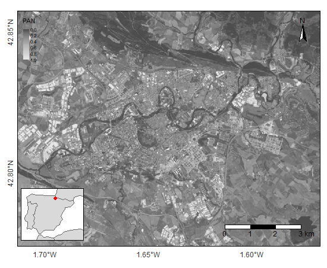

```{r setup, include=FALSE}
knitr::opts_chunk$set(echo = TRUE)
```

------------------------------------------------------------------------

The amount of techniques for processing satellite imagery can be overwhelming. This tutorial is an attempt to summarize and organize some of these techniques, focusing on those available in `R` (either native or via third-party software, e. g. [SAGA](http://www.saga-gis.org/en/index.html)). Other methods are also described, but just enough to provide some context and consider the strengths and limitations in using `R` as a tool for pre-processing satellite images.

------------------------------------------------------------------------

# Intro

The topic of this tutorial is **pansharpening** , i.e. a group of techniques that increase the spatial and spectral resolution of satellite images by fusing images with complementary features. The tutorial gives:

1.  An introduction to the basics of pansharpening ([Section 1](##The%20basics%20of%20pansharpening)),

2.  An overview of methods ([Section 2](##Overview)), and

3.  Descriptions of some methods ([Section 3](##Methods:%20Component%20Substitution)), including a brief theoretical explanations and simple and reproducible examples.

To follow the basics of this tutorial, download [this repository](https://github.com/mmontesinosanmartin/pansharpen_r) and make it your working directory. Also, you need to install [`RStoolbox`](http://bleutner.github.io/RStoolbox/) (Leutner et al., 2019), [`tmap`](https://github.com/mtennekes/tmap) (Tennekes, 2018) and [`raster`](https://rspatial.org/raster/) (Hijamns 2020). If not installed already, type:

```{r, eval=FALSE}
install.packages("raster")
install.packages("RStoolbox")
install.packages("tmap")
```

Make sure to load them in working environment running:

```{r packages, message=FALSE, warning=FALSE}
library("raster")
library("RStoolbox")
library("tmap")
```

For this tutorial, we built the `compare_vis()` function, which can be found in [the repository](https://github.com/mmontesinosanmartin/pansharpen_r). The function has two inputs, the original (`ms.img` attribute) and the pansharpened multi-spectral images (`pan.img` attribute). `compare_vis()` is just a wrapper function of `tmap` instructions that display side-by-side the original and the pansharpened image. One way to load this function into `R` is as follows:

```{r compare_vis}
source("./R/compare_vis.R")
```

------------------------------------------------------------------------

# The basics of pansharpening

Pansharpening methods generally fuse a [**panchromatic**](https://www.quora.com/What-is-the-difference-between-multispectral-and-panchromatic-bands-in-remote-sensing) and a [**multi-spectral**](https://en.wikipedia.org/wiki/Multispectral_image) (or hyper-spectral) image:

<center>

{#panchromatic width="400"}

</center>

-   A **panchromatic** image (*PAN*) is an image showing more details at the spatial level (high spatial resolution). Instruments retrieving *PAN* images sense broader bandwidths (visible and to some degree near-infrared) to increase the signal-to-noise ratio and capture finer spatial details. This also means that panchromatic images have a single band and they do not distinguish the intensities from various wavelengths (low spectral resolution). Here, we use the *PAN* image in the folder `./Data/small_sample`, with a resolution of $15 \times 15m^2$ :

    ```{r}
    # load
    pan.file <- "./Data/small_sample/pan_example.tif"
    pan.img <- raster(pan.file)
    ```

<center>

. The image was captured by Landsat-8 on June 30th 2015"){width="400"}

</center>

-   **Multi-spectral** (*MS*) images carry information about the radiance/reflectance at narrower wavelengths. The difference between multi and hyper-spectral lays on the number of bands (tens vs. hundreds) and how narrow the bandwidths are. Our multi-spectral image has 4 bands; red, green, blue, and near-infrared (*NIR*). The image can be found under `./Data/small_sample` and has a resolution of $30 \times 30m^2$ :

    ```{r}
    # load
    ms.file <- "./Data/small_sample/ms_example.tif"
    ms.img <- stack(ms.file)
    ```

These *PAN* and *MS* images were captured by [Landsat-8](https://es.wikipedia.org/wiki/Landsat_8), on June $30^{th} 2015$. They both belong to the [Collection 1](https://www.usgs.gov/core-science-systems/nli/landsat/landsat-collection-1?qt-science_support_page_related_con=1#qt-science_support_page_related_con) and processing Level 1. In Landsat-8, the *PAN* image comes as an additional band of the multi-spectral image (band 8).

Before pansharpening, the literature recommends to **co-register** the *PAN* and *MS* images so they are properly aligned. This is true even when if they belong to the same platform (Wegmann et al., 2016). The function `coregisterImages()` from `RStoolbox` applies a method. which basically consist in shifting a *slave* image along the vertical and horizontal axes over a *reference* image to maximize the [mutual information](https://en.wikipedia.org/wiki/Mutual_information). This function demands both *master* and *slave* to have the same number of bands.

Here, the co-registration is probably not necessary, as images come from the same instrument. However, we run an informal test with a single band from *MS* and the *PAN,* as mere illustration of the function:

```{r}
# shift from -10 to +10 pixels horizontally and vertically
img.shift <- coregisterImages(ms.img[[1]],
                              pan.img,
                              shift=10,
                              reportStats=TRUE)
img.shift$bestShift
```

As the best shift is $0,0$, we interpret that *PAN* and *MS* images are well aligned along both axes.

------------------------------------------------------------------------

# Overview

Pansharpening methods are classified in two main categories (Alparone et al., 2015):

-   **Component Substitution** (*CS*) methods: These methods project the multi-spectral image into a new vector space. The new vector space disentangles the spatial structure from the spectral information. The component representing the spatial structure is replaced by the *PAN* image. Finally, the image is projected back to the original vector space. Among the most popular *CS* techniques are the *Intensity-Hue-Saturation* method (*IHS*), the *Principal Component Analysis* (*PCA*), and the *Gram-Schmidt* (*GS*) spectral sharpening.

-   **Multi-Resolution Analyses** (*MRA*): This group of methods extract the spatial structure from the *PAN* image through multi-resolution decomposition. The spatial details are then *injected* into an interpolated version of the multi-spectral image. The most popular are the (decimated) *Discrete Wavelet Transform* (*DWT*), *Undecimated Wavelet Transform* (*UDWT*), *A-Trous Wavelet Transform* (*ATW*), and the *Laplacian Pyramid* (*LP*).

A third group combines both *CS* and *MRA*, and thus they are called *hybrid*. Current software in (or linked to) `R` covers some *CS* methods. They provide a high geometrical quality and they are simple and computationally fast. However, they do not consider potential discrepancies between the *PAN* and the *MS* image, leading, in some circumstances, to spectral distortions. They should be used with care (or avoided) for the analysis of spectral signatures (Alparone et al., 2015; Wegmann et al., 2016).

------------------------------------------------------------------------

# Methods: Component Substitution

Mains steps in *CS* sharpening are: (1) interpolate the *MS* image to match the scale of the *PAN* image, (2) define and apply spectral weights to each band to obtain the *intensity image* (i.e., an image representing the darkness-lightness of colors), (3) match the histograms of the *PAN* and the intensity image, so they show similar frequencies for each intensity value, (4) calculate and sum the *injection gains* to the original image (i.e. the proportional part that goes to each band of the original image). Variations of *CS* differ in the definition of the spectral weights in step 2 and the calculation of the injection gains in step 4.

The `RStoolbox` package implements three variants of the *CS* (Leutner et al., 2019) with the `panSharpen()` function; the **Brovey Transform (BT), the Intensity-Hue-Saturation (IHS), and the Principal Component Analysis (PCA)**. Another alternative is using the image processing module from *SAGA* , which additionally includes the Spectral Sharpening. We will check how *SAGA* may boost the computational performance of pansharpening when dealing with large images. Due to the need of third-party software and the methodological overlap between `RStoolbox` and *SAGA*, we relegate its use to the end of this tutorial.

### Brovey Transform (BT)

BT (Gillespie et al., 1987) is one of the simplest pansharpening techniques. BT applies ratios between the bands of the *MS* and the *PAN* to obtain the sharpened image. More specifically, `panSharpen()` first interpolates the *MS* image ($\tilde{MS}$) to match the resolution of the *PAN* image using nearest neighbors, then calculates the intensity image as the mean of all bands ($I = \frac{1}{N} \sum_{k = 1}^{N}{MS_k}$), and finally *injects* the details to the original image by multiplying ratio between the *PAN* and intensity image

$$MS_{PAN,k}= \widetilde{MS}_k \times \frac{PAN}{I}$$

The Brovey transform can be applied setting the argument `method = "brovey"`. BT only deals with the Red-Green-Blue (*RGB*) bands, so we must specify which layer in the *MS* image corresponds to *R*, *G*, and *B*. The red, green, and blue bands in `ms.img` are the 1st, 2nd, and 3rd layers respectively. Thus, we run:

```{r bro_sharpen}
library("RStoolbox")
bro.img <- panSharpen(ms.img, pan.img,r=1,g=2,b=3,method="brovey")
```

We can visually compare the original and the sharpened image with the function `compare_vis()` :

```{r bro_vis, message=FALSE}
compare_vis(bro.img, ms.img, titles = c("Brovey", "Original"))
```

<br> </br>

Go around and explore yourself the difference in spatial detail and color balance between the pansharpened image (left) and the original image (right).

<center>

{width="400"}

</center>

## Intensity-Hue-Saturation (IHS)

IHS (Carper et al., 1990) begins with transformation of the interpolated RGB image ($\widetilde{MS}$) into the [Intensity-Hue-Saturation color space](https://en.wikipedia.org/wiki/HSL_and_HSV), which is a model of visual perception of colors. With this decomposition we extract the intensity image as a linear combination of the *RGB* bands (generally expressed as $I=\sum_{i=0}^{N}w_i\tilde{MS_i}$). The histograms from the intensity and the *PAN* image are matched. Then, the *PAN* replaces the intensity band, and the IHS images is transformed back to Red-Green-Blue. In addition to

```{r ihs_sharpen}
ihs.img <- panSharpen(ms.img, pan.img,r=1,g=2,b=3,method="ihs")
```

Let's display the original and the pansharpened image:

```{r ihs_vis, message=FALSE}
compare_vis(ihs.img, ms.img = ms.img, titles = c("IHS", "Original"))
```

Note that the classical approach only deals with the Red-Green-Blue spectral bands (Wegmann et al., 2016). It preserves the color balance relatively well (Wegmann et al., 2016).

## Principal Component Analysis (PCA)

*PCA* (Licciardi et al., 2012) transforms the spectral bands such that they are projected onto new axes, called *Principal Components*, which are statistically uncorrelated with each other. The components are generally sorted with decreasing variance and the frequent assumption is that the 1st component (*PC1*) is the one that spectrally matches the *PAN*. The weights to compute the intensity image (step 2) and injection gains (step 4) are derived from the *PCA*.

```{r rstoolbox_pca}
pca.img <- panSharpen(ms.img, pan.img,method="pca")
```

Let's have a look at the results:

```{r pca_vis, message=FALSE}
compare_vis(pca.img, ms.img = ms.img, titles = c("PCA", "Original"))
```

The strengths of the *PCA* are the high fidelity reproducing sharp edges and and the ability to deal with more than three bands. The weakness is that it can lead to severe color distortions (Wegmann et al., 2016). The distortion is evident in the lake located on the bottom-right corner of the image. It must be considered that the success of the fusion depends on which extent the assumption regarding $PC1 \sim PAN$ is fulfilled (Alparone et al., 2015).

As a final result, we display all the images together:

```{r all_vis, message=FALSE}
compare_vis(bro.img, ihs.img, pca.img, ms.img, titles = c("BT", "IHS", "PCA", "Original"), lyout = c(1,4))
```

------------------------------------------------------------------------

# Bonus: Large images

The multi-spectral images from above are purposely small ($310 \times400$ pixels). `R` can be slow when dealing with large images. To illustrate the issue, we repeat the analysis with larger *PAN* and *MS* images ($1579 \times 1882$ pixels for the *MS* image). Both images are saved in the `./Data/large_sample` directory. Load them in `R` as follows:

```{r img_large}
ms.lrg <- stack("./Data/large_sample/ms_large_example.tif")
pn.lrg <- raster("./Data/large_sample/pan_large_example.tif")
```

The function `mark()` from the `bench` package (Hester, 2020) tracks the running times in `R` . The argument `time_unit = "m"` ensures consistent time units (here minutes) across tests. We run the three pansharpening techniques from above using the large images. Please, be patient as next lines may take a few minutes)

```{r rstlbx_test,message=FALSE, warning=FALSE}
library(bench)
bro.rstl <- mark(
  panSharpen(ms.lrg, pn.lrg,r=1,g=2,b=3,method="brovey"),
  time_unit = "m")
bro.rstl$min
ihs.rstl <- mark(
  panSharpen(ms.lrg, pn.lrg,r=1,g=2,b=3,method="ihs"),
  time_unit = "m")
ihs.rstl$min
pca.rstl <- mark(
  panSharpen(ms.lrg, pn.lrg, method="pca"),
  time_unit = "m")
pca.rstl$min
```

The code takes `r round(bro.rstl$min,2)`, `r round(ihs.rstl$min,2)`, and `r round(pca.rstl$min,2)` minutes to pansharpen the large *MS* image using an Intel(R) Core(TM) i7-4710HQ CPU at 2.50 GHz. Under similar (or worse) circumstances, it might be worthwhile to consider external libraries such as [SAGA](http://www.saga-gis.org/). This GIS software provides pansharpening techniques within the module called [imagery tools](http://www.saga-gis.org/saga_tool_doc/2.2.1/imagery_tools.html). SAGA offers compiled code, which is significantly faster than `R`. Before continuing with this tutorial, make sure SAGA is [installed](https://sourceforge.net/projects/saga-gis/files/). Once installed, find the *saga_cmd.exe* file and paste the path in the following command. For me:

```{r saga_path}
saga.path <- normalizePath("C:\\OSGeo4W64\\apps\\saga-ltr\\saga_cmd.exe")
```

[The github repository](https://github.com/mmontesinosanmartin/pansharpen_r) provides custom functions to interact with the pansharpening libraries in SAGA. The functions are inside the `./R` folder and there is one function for each pansharpening technique; the *Brovey, IHS*, and *PCA* methods:

```{r saga_wrappers}
source("./R/pansharpen_brovey.R")
source("./R/pansharpen_ihs.R")
source("./R/pansharpen_pca.R")
```

Then, the same analysis can be performed with SAGA as follows:

```{r saga_test}
bro.saga <- mark(pansharpen_brovey(saga.path, ms.lrg, pn.lrg), time_unit = "m")
ihs.saga <- mark(pansharpen_ihs(saga.path, ms.lrg, pn.lrg), time_unit = "m")
pca.saga <- mark(pansharpen_pca(saga.path, ms.lrg, pn.lrg), time_unit = "m")
```

Each of the pansharpening techniques takes `r round(bro.saga$min,2)`, `r round(ihs.saga$min,2)`, and `r round(pca.saga$min,2)` minutes, which saves around $25-50\%$ of the time relative to `RStoolbox`. Note that there is still room for improvement in the custom functions to achieve better computational efficiency. You may also consider using specialized packages, such as `RSAGA` (Brenning, 2018), to achieve better communications between `R` and SAGA. Also, using SAGA from `R` does not always means a faster implementation. With small images, the cost of calling SAGA is greater than the savings from compiled code and native `R` might be preferred.

------------------------------------------------------------------------

# References

Alparone, L., Aiazzi, B., Baronti, S., & Garzelli, A. (2015). Pansharpening of Multispectral Images, in Remote Sensing Image Fusion. *Crc Press*.

Brenning A., Bangs D., and Becker M. (2018). RSAGA: SAGA Geoprocessing and Terrain Analysis. R package version 1.3.0. (URL: <https://CRAN.R-project.org/package=RSAGA>)

Carper W., Lillesand T., and Kiefer , R. (1990). The use of intensity-hue-saturation transformations for merging SPOT panchromatic and multispectral image data. *Photogrammetric Engineering and Remote Sensing*, **56**(4):459--467.

Gillespie, A. R., Kahle, A. B., & Walker, R. E. (1987). Color enhancement of highly correlated images. II. Channel ratio and "chromaticity" transformation techniques. *Remote Sensing of Environment*, **22**(3), 343-365. (URL: [https://doi.org/10.1016/0034-4257(87)90088-5](https://doi.org/10.1016/0034-4257(87)90088-5 "Persistent link using digital object identifier"))

Hester J. (2020). `bench`: High Precision Timing of R Expressions. R package version 1.1.1. (URL: <https://CRAN.R-project.org/package=bench>)

Hijmans R. (2020). `raster`: Geographic Data Analysis and Modeling. R package version 3.3-13. (URL: <https://CRAN.R-project.org/package=raster>)

Leutner B., Horning N., & Schwalb-Willmann, J. (2019). `RStoolbox`: *Tools for Remote Sensing Data Analysis*. R package version 0.2.6. (URL: <https://CRAN.R-project.org/package=RStoolbox>)

Licciardi, G. A., Khan, M. M., Chanussot, J., Montanvert, A., Condat, L., & Jutten, C. (2012). Fusion of hyperspectral and panchromatic images using multiresolution analysis and nonlinear PCA band reduction. *EURASIP Journal on Advances in Signal processing*, **2012**(1), 1-17. (URL: [[https://doi.org/](https://doi.org/10.1016/0034-4257(87)90088-5)10.1109/IGARSS.2011.6049466](https://doi.org/10.1016/0034-4257(87)90088-5 "Persistent link using digital object identifier"))

Tennekes, M. (2018). `tmap`: Thematic Maps in R. *Journal of Statistical Software* **84** (6), 1-39. (URL: [https://doi.org/10.18637/jss.v084.i06).](https://doi.org/10.18637/jss.v084.i06).)

Wegmann, M., Leutner, B., & Dech, S. (Eds.). (2016). Remote sensing and GIS for ecologists: using open source software. *Pelagic Publishing Ltd.*
